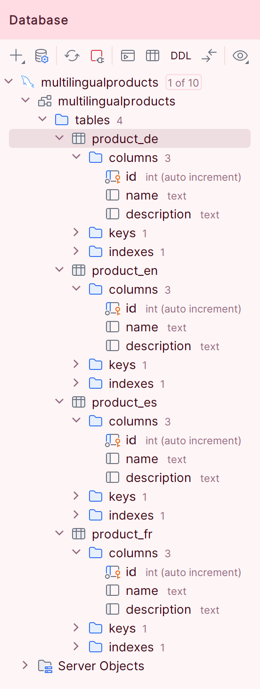
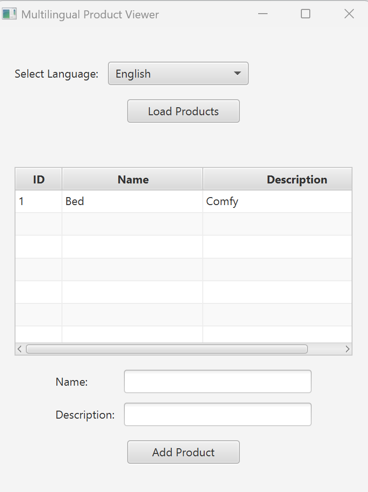
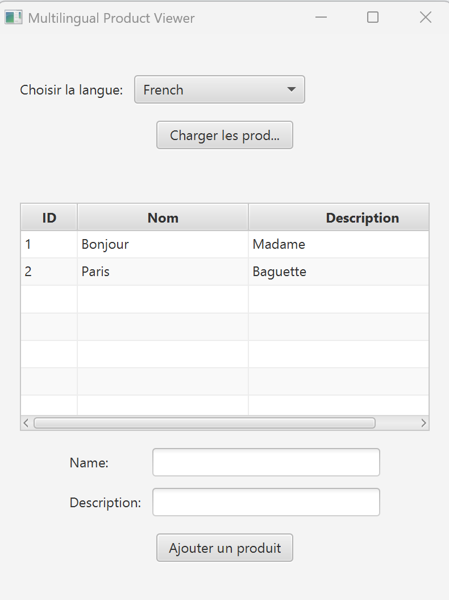
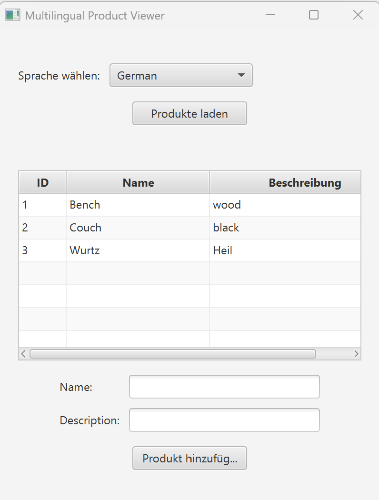
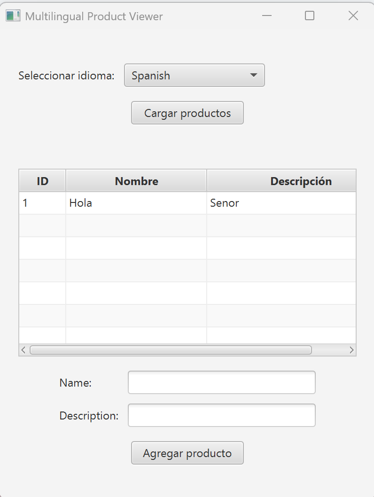

# Multilingual Products Application

This project demonstrates a JavaFX-based product management application with multilingual support. Users can switch between English, French, Spanish, and German, which updates the interface labels and messages accordingly. The application interacts with a MySQL database to store and display product information in different languages.

## Table of Contents
- [Features](#features)
- [Project Structure](#project-structure)
- [Setup Instructions](#setup-instructions)
    - [Prerequisites](#prerequisites)
    - [Installation](#installation)
- [Database Setup](#database-setup)
- [Usage](#usage)
- [Additional Notes](#additional-notes)
- [Screenshots](#screenshots)

## Features
- **Language Selection**: Supports English, French, Spanish, and German with dynamic language switching.
- **Product Management**: Allows adding and loading products to/from a MySQL database.
- **Localized Interface**: Uses property files for localized UI messages.

## Project Structure

Below is an overview of the key files and folders in this project:

```
multilingual_products/
├── src/
│   ├── main/
│   │   ├── java/
│   │   │   └── org/example/multilingual_products/
│   │   │       ├── DatabaseUtil.java                # Manages database connection
│   │   │       ├── LanguageSelectionController.java # Controller for UI actions
│   │   │       ├── MultilingualProductsApp.java     # Main application class
│   │   │       ├── Product.java                     # Product entity class
│   │   │       └── module-info.java                 # Module declaration for JavaFX and dependencies
│   │   ├── resources/
│   │   │   ├── org/example/multilingual_products/
│   │   │   │   ├── language_selection_view.fxml     # JavaFX FXML layout for the app
│   │   │   │   └── images/                          # Image folder for documentation
│   │   │   └── Resource Bundle 'messages'/          # Resource bundle for localization
│   │   │       ├── messages_de.properties           # German messages
│   │   │       ├── messages_en.properties           # English messages
│   │   │       ├── messages_es.properties           # Spanish messages
│   │   │       └── messages_fr.properties           # French messages
├── target/                                          # Build files generated by Maven
├── pom.xml                                          # Maven dependencies and build configuration
└── README.md                                        # Project documentation (this file)
```

## Setup Instructions

### Prerequisites
- **Java JDK 22**: Ensure you have JDK 22 installed. [Download JDK](https://jdk.java.net/22/).
- **Maven**: This project uses Maven for dependency management.
- **MySQL**: You need a MySQL server to store product data.

### Installation

1. **Clone the Repository**

   ```bash
   git clone https://github.com/yourusername/multilingual_products.git
   cd multilingual_products
   ```

2. **Configure Database Credentials**

   In the `src/main/resources/config.properties` file, set your MySQL credentials:

   ```properties
   DB_USER=yourDatabaseUsername
   DB_PASSWORD=yourDatabasePassword
   ```

## Database Setup

### Create the Database

1. **Connect to MySQL**

   Connect to your MySQL server using a client like MySQL Workbench.

2. **Create the Database**

   ```sql
   CREATE DATABASE multilingual_products;
   USE multilingual_products;
   ```

3. **Create Tables**

   Create tables for each supported language to store localized product data:

   ```sql
   CREATE TABLE product_en (
       id INT AUTO_INCREMENT PRIMARY KEY,
       name VARCHAR(100),
       description VARCHAR(255)
   );

   CREATE TABLE product_fr (
       id INT AUTO_INCREMENT PRIMARY KEY,
       name VARCHAR(100),
       description VARCHAR(255)
   );

   CREATE TABLE product_es (
       id INT AUTO_INCREMENT PRIMARY KEY,
       name VARCHAR(100),
       description VARCHAR(255)
   );

   CREATE TABLE product_de (
       id INT AUTO_INCREMENT PRIMARY KEY,
       name VARCHAR(100),
       description VARCHAR(255)
   );
   ```

   *Ensure the `id` column is set to auto-increment to generate unique identifiers automatically.*

## Usage

- Run the application and select a language from the "Select Language" dropdown.
- Click **Load Products** to load product data from the corresponding database table.
- Enter product details (name and description) and click **Add Product** to insert a new product.
- The table view will show "No content in table" if there is no data until you press **Load Products**.

## Screenshots

### Database Structure
*Figure: Database structure showing tables for each language.*



### Application in English
*Figure: Application displaying products in English.*



### Application in French
*Figure: Application displaying products in French.*



### Application in German
*Figure: Application displaying products in German.*



### Application in Spanish
*Figure: Application displaying products in Spanish.*



## Additional Notes

- **Configuration File**: The `config.properties` file contains sensitive information (database credentials). Ensure this file is not exposed publicly.
- **Localized Messages**: Add or update localized strings in the `messages_*.properties` files to modify UI text for different languages.
- **Database Connection**: Ensure your MySQL server is running and accessible when using the application.

Enjoy using the Multilingual Products application!